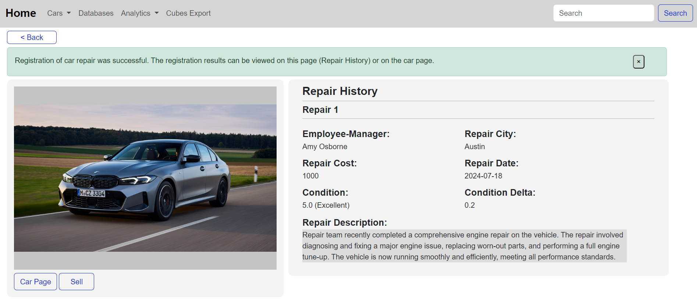

   

   <i>
      An information system for a car resale business in the form of a website, implemented using Python, HTML, CSS, Bootstrap and JavaScript, with a convenient interface, tools for analytical presentation and data export.
   </i>

 

## :dart: Objective
Creation of an information system for the car resale business with the implementation of the following features:
1. **Filling the OLTP storage** with historical transactional data in the case of their availability (for example, if the company previously used another data processing system).
2. **Buying a car**: Registration of the fact of purchase; viewing, searching, filtering of purchased cars and viewing detailed information about the fact of purchase. 
3. **Car repair**: registration of new repair facts; viewing the repair history of each car.
4. **Car price assessment**: provision of automatic initial assessment at the time of car purchase; providing the possibility to manually enter the updated estimated value of the car or an automatic update that will take into account the idle time of the car to calculate the new value.
5. **Car sale**: Registration of the fact of car sale; viewing, searching, filtering of sold cars and viewing detailed information about the fact of sale and profit from the sold car.
6. **Regular transfer of accumulated data to analytical storage**: The possibility of synchronizing the contents of the OLTP database and OLAP storage to ensure the construction of correct analytical reports.
7. **Creation of analytical reports for accumulated data**: Ability to select fact-event, dimensions and hierarchy levels for them and build reports for accumulated data for the purpose of additional business analysis.
8. **View and analyze the graphical presentation of data using an external configured business intelligence system**: View analytical reports built using an external business intelligence system and further use them to make business decisions.

## :floppy_disk: Dataset
The ["Used Car Auction Prices"](https://www.kaggle.com/datasets/tunguz/used-car-auction-prices) dataset found on the [Kaggle](https://www.kaggle.com/) platform was chosen as the historical data source.  
The original dataset contained 558811 sales records of various cars along with vehicle characteristics such as year of manufacture, make, model, trim, transmission, vehicle mileage, and others. However, after dataset preprocessing, the number of records was reduced to 401377.  

## :hammer_and_wrench: Technologies Used

   

The following technologies where used in this project:
- **Working with Data**:
  - **Faker**: Generating fake data.
  - **Gender-Guesser**: Guessing gender from first names.
  - **Pandas**: Data processing and analysis.
  - **Psycopg2**: PostgreSQL database adapter for Python.

- **Backend Part**:
  - **Flask**: Lightweight WSGI web application framework in Python.
  - **SQLAlchemy**: SQL toolkit and Object Relational Mapper for Python.
  - **PostgreSQL**: Popular open source relational database management system (DBMS) known for its reliability, scalability, and extensive feature set.

- **Frontend Part**:
  - **HTML**: Standard markup language for creating web pages.
  - **CSS**: Style sheet language used for describing the presentation of a document written in HTML.
  - **JavaScript (JS)**: Programming language that allows you to implement complex features on web pages.
  - **Bootstrap**: CSS framework for developing responsive and mobile-first websites.

## :toolbox: System Structure

   

The system consists of several parts:
- **Parser & Generator**: Are responsible for reading, preprocessing the dataset data and randomly generating the required data.
- **OLTP DB, ORM & Backend (Transactions)**: Related to transaction facts: registration of the purchase, repairs, valuation and sale of a car with the necessary information (participants of the transaction, date, car characteristics, price, details), viewing for each car the data on the operations performed on it; search, filtering, viewing data about cars.
- **ETL**: Preparation and transfer of accumulated 
data from the OLTP database to the analytical storage (OLAP database) with logging of performed actions.
- **OLAP DB, Psycopg2 & Backend (Analytics)**: Related to analytics and business performance analysis: export of OLAP (Online Analytical Processing) cubes for analytical analysis, availability of interactive information panels for graphical presentation of aggregated data.
- **Frontend**: An interface implemented according to the logic of business processes that correspond to the subject area.

## :open_file_folder: Project Files Description

   

This project consists of a set of modules, each of which is responsible for performing a certain logically unified function of the system:
- **app.py**: The main file, the entry point to the program. It contains endpoints that implement a significant part of the business logic of the information system: registration of purchase, repair, cost estimation, car sale, OLTP database filling, ETL, data export by OLAP cube slices.
- **requirements.txt**: Lists all the dependencies and their versions needed to run the project.
- **cars**: Contains a set of files and folders that are responsible for performing operations on the "Car" entity: filtering, searching, displaying information about an individual car.
- **config**: Is an auxiliary module that contains files with configurations necessary for the correct operation of the information system: permissible values ​​for certain values, connections to databases, relative paths to the corresponding files, displaying information on web pages.
- **data**: Data used in other modules of the information system.
- **databases**: The collection of files and folders that form two autonomous services for interacting with OLTP and OLAP databases and performing OLTP database filling and ETL operations. 
- **logging**: Contains log files that store the results of logging of individual parts of the information system (filling OLTP database, ETL, export of OLAP cubes).
- **static**: The client part of the information system, which consists of **css** (CSS styles of web pages), **images** (image files of icons), **js** (JavaScript scripts for web pages) folders.
- **templates**: HTML files of application web pages.
- **utils**: Auxiliary functions used in other parts of the information system.
- **\_\_init__.py**: Contains Flask web application initialization code, OLTP database connection and cars module connection.
- **forms.py**: Contains the Python code for the HTML forms used in the web application.
- **models.py**: Contains SQLAlchemy ORM classes for interaction with the OLTP database.

## :computer: Functionality Overview
- **Filling the OLTP storage**:
   

      
   

- **Filling the OLAP storage (Primary ETL)**:
   

      
   

- **Registration of Car Purchase**:
  1. **Car Purchase Registration Page**:
      

         
      

  2. **Filled Car Purchase Registration Page**:
      

         
      

   3. **Successful Registration of the Car Purchase**:
      

         
      

  4. **Process of Registration**:
      

         
      

- **View Information about the Car and the Performed Business Operations**:
   

      
   

   

      
   

- **Registration of Car Repair**:
  1. **Car Repair Page**:
      

         
      

   2. **Successful Registration of the Car Repair**:
      

         
      

- **Reestimation of Car Price**:
   1. **Car Reestimation Page**:
      

         
      

   2. **Successful Manual Car Price Reestimation**:
      

         
      

- **Registration of Car Sale**:
  1. **Car Sale Page**:
      

         
      

  2. **Successful Registration of the Car Sale**:
      

         
      
